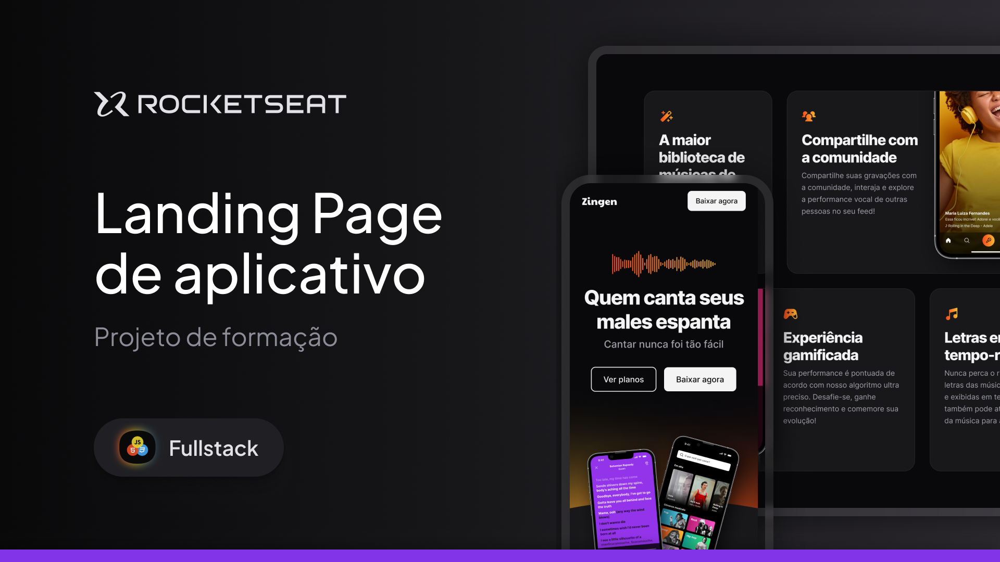

<h1 align="center">Landing Page de aplicativo</h1>

Programa feito no quadro do curso Full-Stack da Rocketseat.  

 

  
  Imagem feita por <a href="/ilanamallak">Ilana Mallak</a>

## 🚀 Tecnologias

Esse projeto foi desenvolvido com as seguintes tecnologias:

- HTML e CSS
- Git e Github
- Figma

## 🖥️ Projeto

Nesse projeto desenvolvi a Landing Page de marketing completa e responsiva de um aplicativo de Karaokê chamado Zingen.
Esse é um dos projetos desenvolvidos em aula na formação Full-stack.
